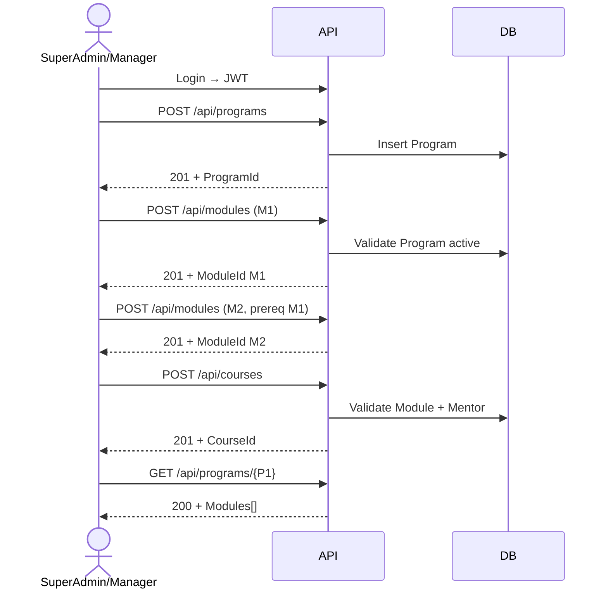

# SuperAdmin / Manager — Curriculum Create Flow Test Plan

Test plan for the **admin create workflow** only: authenticated `SuperAdmin` or `Manager` provisions a new curriculum starting from **Program**, then **Module**, then **Course**.

> Out of scope here: update, delete, enrollment, orphan cleanup. See [`Program-Module-Course-Flow-TestPlan.md`](./Program-Module-Course-Flow-TestPlan.md) for full lifecycle.

---

## 1. Role & Authorization

| Role | Can create Program / Module / Course |
|------|--------------------------------------|
| `SuperAdmin` | Yes |
| `Manager` | Yes |
| Other roles (`Mentor`, `Student`, `Parent`, …) | No — expect **403 Forbidden** |
| Unauthenticated | No — expect **401 Unauthorized** |

Protected endpoints (both roles):

| Step | Method | Endpoint |
|------|--------|----------|
| Create program | `POST` | `/api/programs` |
| Create module | `POST` | `/api/modules` |
| Create course | `POST` | `/api/courses` |

Read endpoints used for verification (`GET`) are **not** role-restricted in controllers.

---

## 2. Prerequisites (before Step 1)

| # | Requirement | Notes |
|---|-------------|-------|
| 1 | Valid JWT for `SuperAdmin` **or** `Manager` | Obtain via login API used by the project |
| 2 | Mentor user exists in DB | `CreateCourseAsync` requires active `MentorId` |
| 3 | Unique codes per table | `PRG-*`, `MOD-*`, `CRS-*` unique within their own table |

### Seed accounts (development)

After `SeedService.SeedAllDataAsync()`:

| Role | Email | Password |
|------|-------|----------|
| SuperAdmin | `superadmin@oboxsteam.com` | `Admin@123` |
| Manager | `manager@oboxsteam.com` | `Manager@123` |
| Mentor | `mentor@oboxsteam.com` | `Mentor@123` |

Use mentor `Id` from `GET /api/users` or seed data when building the course request.

---

## 3. Admin Create Flow (happy path)

```
Login (SuperAdmin or Manager)
    │
    ▼
① POST /api/programs          → ProgramId (P1)
    │
    ▼
② POST /api/modules (×N)      → ModuleId(s), ProgramId = P1
    │   (optional: M2 prereq M1, same program)
    ▼
③ POST /api/courses (×N)      → CourseId(s), ModuleId + MentorId
    │
    ▼
④ GET verify (optional)       → Program shows modules; courses retrievable
```



---

## 4. Test Cases

### AUTH — Authentication & authorization

#### AUTH-1 — SuperAdmin can start create flow

| Step | Action | Expected |
|------|--------|----------|
| 1 | Login as SuperAdmin, obtain JWT | Token received |
| 2 | `POST /api/programs` with Bearer token | **201 Created** |

#### AUTH-2 — Manager can start create flow

| Step | Action | Expected |
|------|--------|----------|
| 1 | Login as Manager, obtain JWT | Token received |
| 2 | `POST /api/programs` with Bearer token | **201 Created** |

#### AUTH-3 — Unauthenticated cannot create program

| Step | Action | Expected |
|------|--------|----------|
| 1 | `POST /api/programs` without `Authorization` header | **401 Unauthorized** |

#### AUTH-4 — Non-admin cannot create program

| Step | Action | Expected |
|------|--------|----------|
| 1 | Login as `Mentor` (or `Student`) | Token received |
| 2 | `POST /api/programs` | **403 Forbidden** |

#### AUTH-5 — Same rules for module and course

| Step | Action | Expected |
|------|--------|----------|
| 1 | As non-admin, `POST /api/modules` | **403** |
| 2 | As non-admin, `POST /api/courses` | **403** |
| 3 | Without token, `POST /api/modules` / `POST /api/courses` | **401** |

---

### STEP-1 — Create program (entry point)

#### STEP-1.1 — Happy: create program (SuperAdmin)

**Request:** `POST /api/programs`

```json
{
  "code": "PRG-ADMIN-01",
  "name": "Robotics Master Track",
  "seriesName": "Obox Master Track",
  "description": "Full robotics curriculum",
  "level": "Beginner",
  "estimatedDuration": "3 months",
  "skillsGained": "robotics, coding",
  "thumbnailUrl": "https://example.com/thumb.png",
  "status": "Active",
  "price": 999
}
```

| Step | Action | Expected |
|------|--------|----------|
| 1 | Send request as SuperAdmin | **201 Created** |
| 2 | Assert body `ApiResult` success, `data.id` = `P1` | Program returned |
| 3 | Assert `data.modules` is empty `[]` | No modules yet |
| 4 | `Location` / `CreatedAtAction` points to `GET /api/programs/{P1}` | — |

#### STEP-1.2 — Happy: create program (Manager)

Same body as STEP-1.1 with a **different** `code` (e.g. `PRG-ADMIN-02`).

| Step | Action | Expected |
|------|--------|----------|
| 1 | Send as Manager | **201 Created** |

#### STEP-1.3 — Unhappy: duplicate program code

| Step | Action | Expected |
|------|--------|----------|
| 1 | Repeat `POST` with same `code` as STEP-1.1 | **409 Conflict** |

---

### STEP-2 — Create modules under program

> **Blocked until STEP-1 succeeds.** Store `P1` from response.

#### STEP-2.1 — Happy: create first module (no prerequisite)

**Request:** `POST /api/modules`

```json
{
  "code": "MOD-ADMIN-01",
  "programId": "{P1}",
  "name": "Intro Robotics",
  "moduleType": "Theory",
  "moduleOrder": 1,
  "isMandatory": true,
  "price": 100,
  "retakeFee": 25
}
```

| Step | Action | Expected |
|------|--------|----------|
| 1 | Send as SuperAdmin or Manager | **201 Created** |
| 2 | Assert `data.programId` = `P1` | Linked to program |
| 3 | Store `data.id` = `M1` | — |

#### STEP-2.2 — Happy: create second module with prerequisite

**Request:** `POST /api/modules`

```json
{
  "code": "MOD-ADMIN-02",
  "programId": "{P1}",
  "name": "Build a Bot",
  "moduleType": "Experiential",
  "moduleOrder": 2,
  "prerequisiteModuleId": "{M1}",
  "isMandatory": true,
  "price": 150,
  "retakeFee": 50
}
```

| Step | Action | Expected |
|------|--------|----------|
| 1 | Send as admin | **201 Created**, `data.id` = `M2` |
| 2 | Assert `prerequisiteModuleId` = `M1` | Prerequisite set |

#### STEP-2.3 — Unhappy: create module before program exists

| Step | Action | Expected |
|------|--------|----------|
| 1 | `POST /api/modules` with random `programId` | **404 Not Found** |

#### STEP-2.4 — Unhappy: duplicate module code

| Step | Action | Expected |
|------|--------|----------|
| 1 | Repeat `POST` with `code` = `MOD-ADMIN-01` | **409 Conflict** |

#### STEP-2.5 — Unhappy: prerequisite from another program

| Step | Action | Expected |
|------|--------|----------|
| 1 | Create second program `P2` | **201** |
| 2 | `POST /api/modules` under `P2` with `prerequisiteModuleId` = `M1` (belongs to `P1`) | **400 Bad Request** |

---

### STEP-3 — Create courses under modules

> **Blocked until STEP-2 succeeds.** Requires `M1` or `M2` and mentor `U1`.

#### STEP-3.1 — Happy: create course on first module

**Request:** `POST /api/courses`

```json
{
  "code": "CRS-ADMIN-01",
  "moduleId": "{M1}",
  "mentorId": "{U1}",
  "name": "Robotics Cohort A",
  "description": "Evening cohort"
}
```

| Step | Action | Expected |
|------|--------|----------|
| 1 | Send as SuperAdmin or Manager | **201 Created** |
| 2 | Assert `data.moduleId` = `M1`, `data.mentorId` = `U1` | — |
| 3 | Store `data.id` = `C1` | — |

#### STEP-3.2 — Happy: create second course on lab module

Use `moduleId` = `M2`, new `code` = `CRS-ADMIN-02`.

| Step | Action | Expected |
|------|--------|----------|
| 1 | Send as admin | **201 Created** |

#### STEP-3.3 — Unhappy: create course before module exists

| Step | Action | Expected |
|------|--------|----------|
| 1 | After STEP-1 only (no modules), `POST /api/courses` with random `moduleId` | **404 Not Found** |

#### STEP-3.4 — Unhappy: invalid or missing mentor

| Step | Action | Expected |
|------|--------|----------|
| 1 | `POST /api/courses` with non-existent `mentorId` | **404 Not Found** |
| 2 | `POST /api/courses` with soft-deleted mentor | **404 Not Found** |

#### STEP-3.5 — Unhappy: duplicate course code

| Step | Action | Expected |
|------|--------|----------|
| 1 | Repeat `POST` with `code` = `CRS-ADMIN-01` | **409 Conflict** |

---

### STEP-4 — Verify after create (admin smoke)

No special role required for `GET`; admin verifies the hierarchy built correctly.

#### STEP-4.1 — Program detail lists modules in order

| Step | Action | Expected |
|------|--------|----------|
| 1 | `GET /api/programs/{P1}` | **200 OK** |
| 2 | Assert `data.modules` count = 2 | M1, M2 present |
| 3 | Assert modules sorted by `moduleOrder` | M1 then M2 |

#### STEP-4.2 — Each course retrievable

| Step | Action | Expected |
|------|--------|----------|
| 1 | `GET /api/courses/{C1}` | **200**, `moduleId` = `M1` |
| 2 | `GET /api/modules/{M1}` | **200**, `programId` = `P1` |

#### STEP-4.3 — List endpoints reflect new data

| Step | Action | Expected |
|------|--------|----------|
| 1 | `GET /api/programs?search=Robotics` | Includes `PRG-ADMIN-01` |
| 2 | `GET /api/modules?search=Intro` | Includes `MOD-ADMIN-01` |
| 3 | `GET /api/courses?moduleName=Intro` | Includes `CRS-ADMIN-01` |

---

## 5. End-to-end checklist (one run)

Execute as **SuperAdmin** or **Manager** (repeat once per role if needed).

| # | Step | HTTP | Expected |
|---|------|------|----------|
| 1 | Login | — | JWT |
| 2 | Create program | `POST /api/programs` | 201 |
| 3 | Create module M1 | `POST /api/modules` | 201 |
| 4 | Create module M2 (prereq M1) | `POST /api/modules` | 201 |
| 5 | Create course C1 on M1 | `POST /api/courses` | 201 |
| 6 | Create course C2 on M2 | `POST /api/courses` | 201 |
| 7 | Verify program | `GET /api/programs/{P1}` | 200, 2 modules |
| 8 | Verify course | `GET /api/courses/{C1}` | 200 |

---

## 6. Test data summary

| Entity | Code example | Parent |
|--------|--------------|--------|
| Program | `PRG-ADMIN-01` | — |
| Module M1 | `MOD-ADMIN-01` | `programId` → P1 |
| Module M2 | `MOD-ADMIN-02` | P1, `prerequisiteModuleId` → M1 |
| Course C1 | `CRS-ADMIN-01` | `moduleId` → M1, `mentorId` → U1 |
| Course C2 | `CRS-ADMIN-02` | `moduleId` → M2, `mentorId` → U1 |

---

## 7. Implementation notes

| Item | Recommendation |
|------|----------------|
| Test type | API integration (`WebApplicationFactory`) with JWT per role |
| Order | Always **Program → Module → Course**; never skip steps |
| Isolation | Unique `code` suffix per test run (e.g. timestamp) to avoid 409 |
| Mentor | Resolve `mentorId` from seed before STEP-3 |

---

## 8. Quick reference — HTTP status

| Situation | Status |
|-----------|--------|
| Create success | **201** |
| Missing parent / mentor | **404** |
| Duplicate code | **409** |
| Prerequisite wrong program | **400** |
| No token | **401** |
| Wrong role | **403** |
| Invalid pagination on GET lists | **400** (controller only) |
