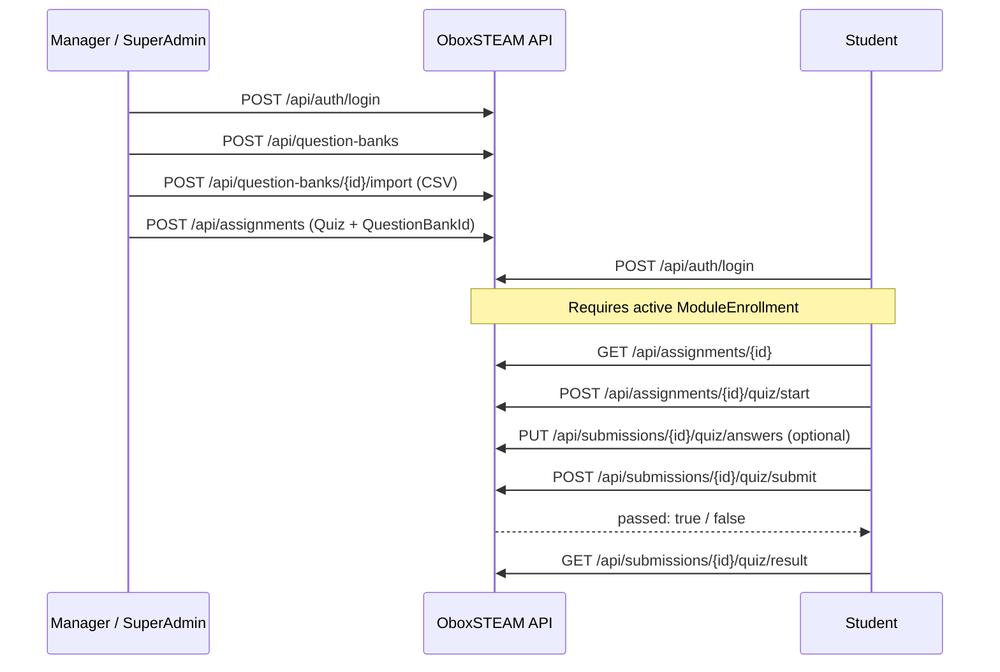

# Assignment Quiz — End-to-End Flow

Step-by-step guide to test the full quiz lifecycle: Manager/SuperAdmin creates a
question bank and assignment, Student takes the quiz, and receives a **Pass** or
**Not Pass** result.

For API envelope and auth conventions, see [api-conventions.md](./api-conventions.md).
For entity overview, see [assessment.md](./assessment.md).

## Overview



## Prerequisites

| Requirement | Detail |
| --- | --- |
| Admin role | `SuperAdmin` or `Manager` |
| Student role | `Student` |
| Enrollment | Student must have an **active** `ModuleEnrollment` in the assignment's module |
| Quiz mode | Assignment must have `questionBankId` set (Mode A — bank-drawn quiz) |
| Availability | `availableFrom` ≤ now ≤ `availableUntil`, and not past `dueDate` |

### Seed data caveat

The seeded assignment `ASG-ROBOTICS-QUIZ-01` does **not** link a question bank
(questions are attached directly on the assignment). It **cannot** be used with
`POST /api/assignments/{id}/quiz/start`. Create a new assignment using the flow
below.

### Seed accounts (after running seed)

| Role | Email | Password |
| --- | --- | --- |
| SuperAdmin | `superadmin@oboxsteam.com` | `Admin@123` |
| Manager | `manager@oboxsteam.com` | `Admin@123` |
| Student | `student1@oboxsteam.com` | `Student@123` |

`student1` is pre-enrolled in module `MOD-ROBOTICS-01`.

---

## Phase 1 — Admin: Login

```http
POST /api/auth/login
Content-Type: application/json

{
  "email": "manager@oboxsteam.com",
  "password": "Admin@123"
}
```

Use the returned `accessToken` on subsequent requests:

```http
Authorization: Bearer {accessToken}
```

---

## Phase 2 — Admin: Create Question Bank

Resolve `courseId` via `GET /api/courses` (e.g. course `CRS-ROBOTICS-01`).

```http
POST /api/question-banks
Authorization: Bearer {adminToken}
Content-Type: application/json

{
  "courseId": "{courseId}",
  "name": "Robotics Quiz Bank",
  "description": "Bank for module quiz"
}
```

Save `data.id` from the response as `questionBankId`.

---

## Phase 3 — Admin: Import Questions (CSV)

Create `questions.csv`:

```csv
QuestionText,QuestionType,Difficulty,Points,Option1,IsCorrect1,Option2,IsCorrect2,Option3,IsCorrect3
What is a sensor used for?,SingleChoice,Easy,10,Detect environment,true,Decorate robot,false,,
Which are robot parts?,MultipleChoice,Medium,10,Motor,true,Wheel,true,Screen,false
What is Arduino?,SingleChoice,Hard,10,Microcontroller,true,Operating system,false,,
```

```http
POST /api/question-banks/{questionBankId}/import
Authorization: Bearer {adminToken}
Content-Type: multipart/form-data

file: questions.csv
```

CSV rules:

- **Difficulty**: `Easy`, `Medium`, or `Hard`
- **QuestionType**: `SingleChoice` or `MultipleChoice`
- At least one `OptionN` / `IsCorrectN` column pair is required

---

## Phase 4 — Admin: Create Quiz Assignment

Resolve `moduleId` via `GET /api/modules` (e.g. `MOD-ROBOTICS-01`).

```http
POST /api/assignments
Authorization: Bearer {adminToken}
Content-Type: application/json

{
  "code": "ASG-QUIZ-TEST-01",
  "moduleId": "{moduleId}",
  "courseId": "{courseId}",
  "title": "Robotics Quiz Test",
  "description": "End-to-end quiz test",
  "assignmentType": "Quiz",
  "maxPoints": 100,
  "passScore": 60,
  "isRequiredForModulePass": true,
  "availableFrom": "2026-01-01T00:00:00Z",
  "availableUntil": "2027-12-31T23:59:59Z",
  "dueDate": "2027-06-30T23:59:59Z",
  "allowShuffle": true,
  "questionBankId": "{questionBankId}",
  "questionCount": 3,
  "shuffleOptions": true,
  "easyPercent": 34,
  "mediumPercent": 33,
  "hardPercent": 33,
  "timeLimitMinutes": 30,
  "maxAttempts": 3
}
```

Validation rules:

- `easyPercent + mediumPercent + hardPercent` must equal **100**
- `questionCount` must be ≤ number of questions in the bank
- `passScore` is the minimum `assignedGrade` required to pass (e.g. 60 out of 100)

---

## Phase 5 — Student: Prepare

### 5.1 Login

```http
POST /api/auth/login
Content-Type: application/json

{
  "email": "student1@oboxsteam.com",
  "password": "Student@123"
}
```

### 5.2 Enroll in module (if not already enrolled)

```http
POST /api/module-enrollments
Authorization: Bearer {studentToken}
Content-Type: application/json

{
  "programEnrollmentId": "{programEnrollmentId}",
  "moduleId": "{moduleId}"
}
```

`student1` + `MOD-ROBOTICS-01` is usually already enrolled after seed.

### 5.3 View assignment details

```http
GET /api/assignments/{assignmentId}
Authorization: Bearer {studentToken}
```

---

## Phase 6 — Student: Take the Quiz

### Step 1 — Start (or resume a Pending submission)

```http
POST /api/assignments/{assignmentId}/quiz/start
Authorization: Bearer {studentToken}
```

Response (`QuizAttemptResponseDto`):

| Field | Purpose |
| --- | --- |
| `submissionId` | Use for all subsequent quiz calls |
| `questions[]` | Snapshot drawn randomly from the bank |
| `questions[].options[]` | No `isCorrect` — correct answers are hidden |
| `timeLimitMinutes`, `startedAt`, `expiresAt` | Timer when `timeLimitMinutes` is set |

### Step 2 — Save draft answers (optional)

```http
PUT /api/submissions/{submissionId}/quiz/answers
Authorization: Bearer {studentToken}
Content-Type: application/json

{
  "answers": [
    {
      "questionId": "{questionId1}",
      "selectedOptionIds": ["{optionId}"]
    }
  ]
}
```

Partial answers are allowed while status is `Pending`.

### Step 3 — Submit

```http
POST /api/submissions/{submissionId}/quiz/submit
Authorization: Bearer {studentToken}
Content-Type: application/json

{
  "answers": [
    {
      "questionId": "{questionId1}",
      "selectedOptionIds": ["{optionId}"]
    },
    {
      "questionId": "{questionId2}",
      "selectedOptionIds": ["{optionIdA}", "{optionIdB}"]
    },
    {
      "questionId": "{questionId3}",
      "selectedOptionIds": ["{optionId}"]
    }
  ]
}
```

Submit rules:

- Every question in the snapshot must have at least one selected option
- `SingleChoice` → exactly one option
- `MultipleChoice` → one or more options
- Send `"answers": []` if all answers were already saved via PUT

---

## Phase 7 — Pass / Not Pass Result

The submit response (`QuizResultResponseDto`) includes the grade immediately:

```json
{
  "submissionId": "...",
  "assignmentId": "...",
  "attemptNumber": 1,
  "assignedGrade": 66.67,
  "maxPoints": 100,
  "passScore": 60,
  "passed": true,
  "correctCount": 2,
  "totalQuestions": 3,
  "status": "Graded",
  "submittedAt": "..."
}
```

Retrieve the result again later:

```http
GET /api/submissions/{submissionId}/quiz/result
Authorization: Bearer {studentToken}
```

### Scoring logic

Grading uses equal points per question: `MaxPoints / questionCount`.

```
assignedGrade = round(correctCount × pointsPerQuestion, 2)
passed        = assignedGrade >= passScore
```

| Outcome | Condition |
| --- | --- |
| **Pass** | `passed: true` when `assignedGrade >= passScore` |
| **Not Pass** | `passed: false` when `assignedGrade < passScore` |

Example: 3 questions, `maxPoints = 100`, `passScore = 60` → ~33.33 points per
question. 2/3 correct → `66.67` → **Pass**. 1/3 correct → `33.33` → **Not Pass**.

---

## Common Errors

| HTTP | Cause |
| --- | --- |
| 403 | Student not enrolled in module, or assignment not yet available |
| 400 | Assignment has no `questionBankId` |
| 400 | Empty bank or `questionCount` exceeds bank size |
| 409 | `maxAttempts` exhausted, or submission no longer `Pending` |
| 400 | Submit missing answers for one or more questions |

---

## Quick Test Checklist

1. Admin login → create question bank → import CSV (≥ 3 questions)
2. Admin create Quiz assignment with `questionBankId`
3. Student login (enrolled in the module)
4. `POST .../quiz/start` → note `submissionId`, `questionId`, and `optionId` values
5. Submit all correct answers → expect `passed: true`
6. If `maxAttempts > 1`, start a new attempt and submit all wrong → expect `passed: false`

---

## Related Endpoints

| Actor | Method | Path |
| --- | --- | --- |
| Admin | `POST` | `/api/question-banks` |
| Admin | `POST` | `/api/question-banks/{id}/import` |
| Admin | `POST` | `/api/assignments` |
| Student | `GET` | `/api/assignments/{id}` |
| Student | `POST` | `/api/assignments/{id}/quiz/start` |
| Student | `GET` | `/api/submissions/{id}/quiz` |
| Student | `PUT` | `/api/submissions/{id}/quiz/answers` |
| Student | `POST` | `/api/submissions/{id}/quiz/submit` |
| Student | `GET` | `/api/submissions/{id}/quiz/result` |
